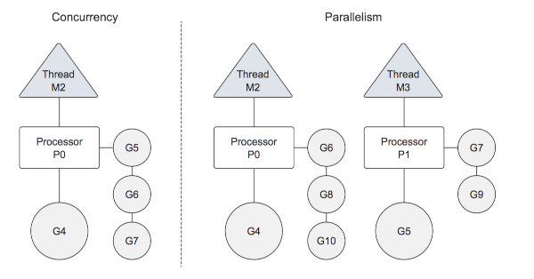

# Overview

## Concurrency vs Parallelism

> Image Credits: https://github.com/sathishvj/optimizing-go-programs#m-p-g

## Overview of Go scheduler

- OS vs Go Scheduler

> Image Credits: https://speakerdeck.com/kavya719/the-scheduler-saga?slide=15

- OS Thread & Go Routine Scheduling

> Image Credits: https://speakerdeck.com/kavya719/the-scheduler-saga?slide=18

- OS threads are kernel-space threads
- goroutines are user-space threads, lighter than OS threads
- Go's scheduler is responsible for mapping goroutines on to OS threads
- `GOMAXPROCS` controls the max number of OS threads a go program can create
- For `m` running goroutines, the scheduler maps them to `n` threads
- The scheduler maintains a run queue for each thread
- Threads can steal work from other threads when their run queue is empty
- Goroutines don't run to completion,
  - They are pre-emptively scheduled
  - And they can be context switched when blocked

## Concurrency in Go

- Goroutines
  - `go` keyword
  - M:N scheduler
- sync
  - `sync.WaitGroup`
  - `sync.Mutex`
    - `sync.RWMutex`
  - Data Race condition: `-race` flag
    - Available across the tool chain
- Channels
  - Buffered `make(chan <type>, <n>)`
  - Unbuffered `make(chan <type>)`
    - `<-ch`
      - Receiving from a channel; blocks if there is nothing to receive
    - `ch <-`
      - Sending to a channel;
        - blocks if the buffer is full! (Buffered channel)
        - blocks until there is a receive! (Unbuffered channel)
  - `range`
    - Loops for next value received from channel
    - Blocks until the channel is closed
  - `close`
    - receive from closed channel: no blocking; returns zero-value, flag
    - send to a closed channel: panic
  - `cap`
- Select
  - The select statement lets a goroutine wait on multiple communication operations.
  - A select blocks until one of its cases can run, then it executes that case. It chooses one at random if multiple are ready.
  - The default case in a select is run if no other case is ready.

### Other Packages

- `context` package
  - Useful for signaling multiple goroutines at the same time
  - Useful for controlling goroutine execution
  - Useful for sharing values across goroutine boundaries
