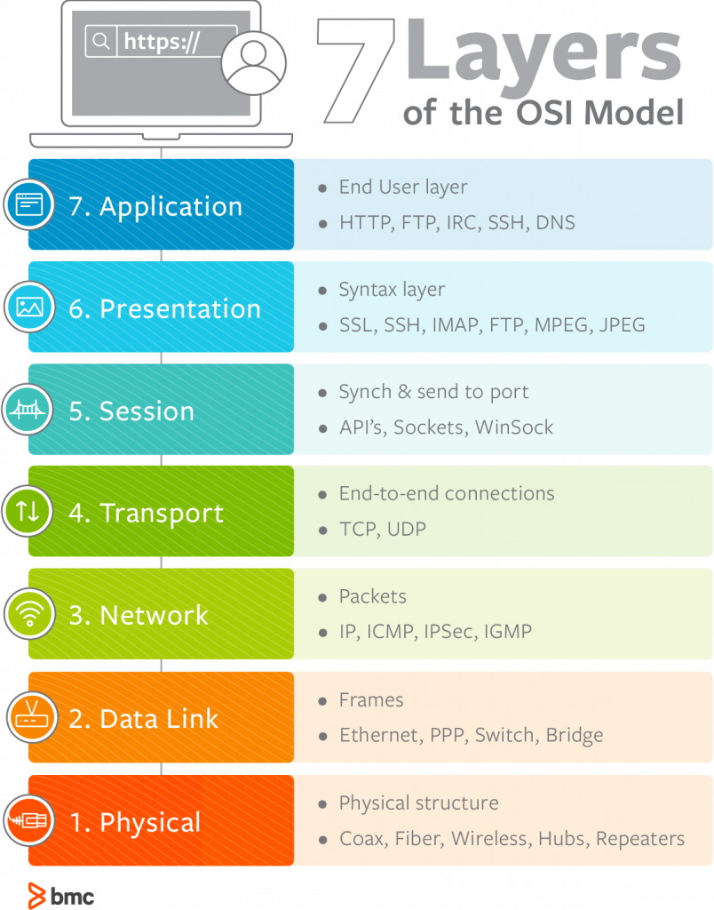
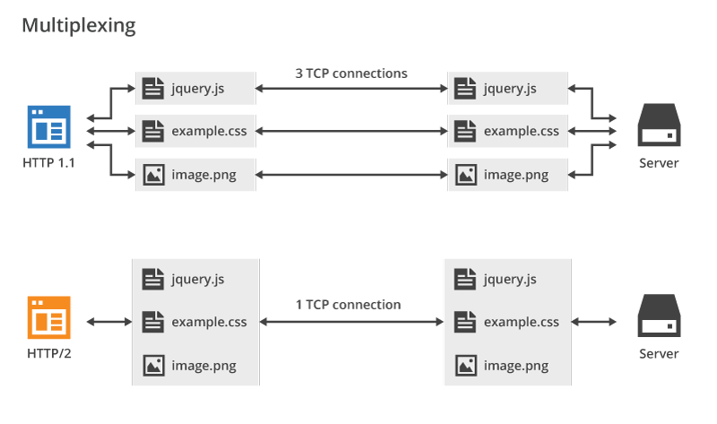
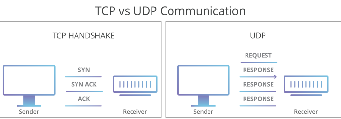
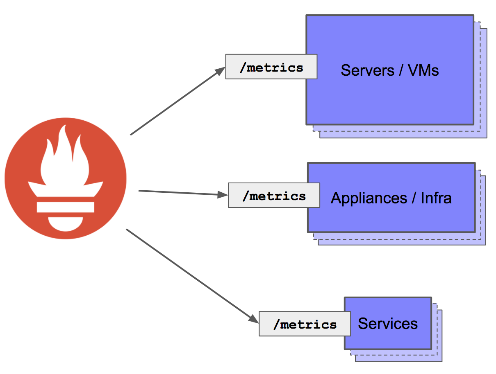
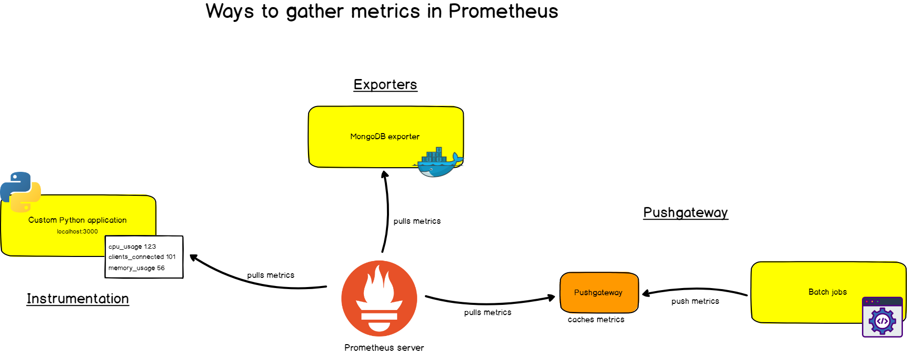

# Overview

## Sweets spots of Go

* Why Go?

### Compiling cross-platform binaries

* `GOOS` & `GOARCH` environment variables

### Concurrency vs Parallelism

OS Overview

> Image Credits: https://github.com/sathishvj/optimizing-go-programs#m-p-g

Concurrency vs Parallelism

> Image Credits: https://github.com/sathishvj/optimizing-go-programs#m-p-g

* Overview of Go scheduler

OS vs Go Scheduler

> Image Credits: https://speakerdeck.com/kavya719/the-scheduler-saga?slide=15

OS Thread & Go Routine Scheduling

> Image Credits: https://speakerdeck.com/kavya719/the-scheduler-saga?slide=18

* `GOMAXPROCS` controls the max number of OS threads a go program can create

### Other Packages

* `context` package
  * Useful for signaling multiple goroutines at the same time
  * Useful for controlling goroutine execution
  * Useful for sharing values across goroutine boundaries

---

## Building Services

### OSI Layers

> Image Credits: https://www.bmc.com/blogs/osi-model-7-layers/

### ReST

* Works well with HTTP 1.1
* Usually, is JSON based, protobuf is rarely used

### gRPC

* Works on top of HTTP 2
* Usually, uses protobuf for messaging, JSON is optional
  * Uses *proto3* syntax
* Auto-generates client and server side stubs

### HTTP 1.1 vs HTTP 2 Service (Layer 5, 6 & 7)

> Image Credits: https://blog.cloudflare.com/introducing-http2/

* Text-based protocol
* Human readable
* Useful for application to application communication

#### HTTP 2

* Secure by default
  * opportunistic encryption (*TLS for http:// URLs*)

#### HTTP 3

> Image Credits: https://kinsta.com/blog/http3/

### TCP vs UDP Service (Layer 4)

> Image Credits: https://blog.cloudflare.com/introducing-http2/

> Image Credits: https://www.cse.iitk.ac.in/users/dheeraj/cs425/lec18.html

> Image Credits: https://www.cloudflare.com/learning/ddos/glossary/user-datagram-protocol-udp/

* Ports are defined at this layer
* Allows for process to process communication

### IP (Layer 3)

> Image Credits: https://www.comparitech.com/blog/vpn-privacy/ipv6-vs-ipv4/

* Provides logical addressing
* Datagram sequencing

---

## Security

### [OWASP](https://owasp.org/)

#### [Top 10](https://owasp.org/www-project-top-ten/)

* Injection: *Injection flaws, such as SQL, NoSQL, OS, and LDAP injection, occur when untrusted data is sent to an interpreter as part of a command or query.*

* Broken Authentication: *authentication and session management functions are often implemented incorrectly*

* Sensitive Data Exposure: *Sensitive data may be compromised without extra protection, such as encryption at rest or in transit, and requires special precautions when exchanged with the browser.*

* XML External Entities: *External entities can be used to disclose internal files using the file URI handler, internal file shares, internal port scanning, remote code execution, and denial of service attacks.*

* Broken Access Control: *Restrictions on what authenticated users are allowed to do are often not properly enforced.*

* Security Misconfiguration: *Security misconfiguration is the most commonly seen issue. This is commonly a result of insecure default configurations, incomplete or ad hoc configurations, open cloud storage, misconfigured HTTP headers, and verbose error messages containing sensitive information.*

* Cross-Site Scripting XSS: *XSS allows attackers to execute scripts in the victim’s browser which can hijack user sessions, deface web sites, or redirect the user to malicious sites.*

* Insecure Deserialization: *Insecure deserialization often leads to remote code execution.*

* Using Components with Known Vulnerabilities: *Components, such as libraries, frameworks, and other software modules, run with the same privileges as the application.*

* Insufficient Logging & Monitoring: *Most breach studies show time to detect a breach is over 200 days, typically detected by external parties rather than internal processes or monitoring.*

#### Best practices for Go (Basic Hardening)

* Validate input entries: *To validate user input, you can use native Go packages like `strconv` to handle string conversions to other data types. Go also has support for regular expressions with `regexp` for complex validations. Even though Go’s preference is to use native libraries, there are third-party packages like `validator`. With `validator`, you can include validations for structs or individual fields more easily.*

* Use HTML templates: *Go has the package html/template to encode what the app will return to the user.*

* Protect yourself from SQL injections: Use prepared statements

* Encrypt sensitive information: *there’s a Go package that includes robust implementations to encrypt information like `crypto`. OWASP has a few [recommendations](https://cheatsheetseries.owasp.org/cheatsheets/Password_Storage_Cheat_Sheet.html#leverage-an-adaptive-one-way-function) of which encryption algorithms to use, such as bcrypt, PDKDF2, Argon2, or scrypt.*

* Enforce HTTPS communication: Let's encrypt is the leading free certificate provider in the world. It has issued more than a [billion certificates](https://letsencrypt.org/2020/02/27/one-billion-certs.html), powering ~200 million sites across the globe. There is not a single reason to skip on TLS anymore.

* Be mindful with errors and logs: Extensive logging, being mindful of not logging sensitive information is important.

### Using Let's Encrypt

Let's encrypt uses the ACME ([Automatic certificate Management Environment](https://en.wikipedia.org/wiki/Automated_Certificate_Management_Environment)) protocol to issue SSL certs automatically. [`autocert`](https://godoc.org/golang.org/x/crypto/acme/autocert), a third-party package, comes in handy when configuring a go server with certificates.

* The standard port for HTTPS is 443
* You can run only HTTP, only HTTPS or both
* If the server doesn’t have a certificate, it’ll use HTTP API to ask Let’s Encrypt servers for it.
* You must set up DNS correctly.

### Authentication mechanisms

#### Basic Auth

* Sends credentials in plain text (TLS has it encrypted) over the headers
* Simple to implement, simple to bypass

#### [JWT](https://jwt.io/) - JSON Web Token

* *JSON Web Tokens are an open, industry standard RFC 7519 method for representing claims securely between two parties.*
* *it's a signed JSON object that does something useful (for example, authentication). It's commonly used for Bearer tokens in Oauth 2. A token is made of three parts, separated by .'s. The first two parts are JSON objects, that have been base64url encoded. The last part is the signature, encoded the same way.*
* They replace the now-obsolete method of maintaining client session info on the server side
* JWT token can contain user info within them

## Performance Engineering

### Writing benchmarks

* `go test --bench . --benchmem`
  * `func Benchmark<>(b *testing.B)`
  * `b.N`
    * Don't use it as an argument for your code being benchmarked
    * Use it to run the code `N` times

### API Load Testing

* Common across languages
  * `wrk` for ReSTful/SOAP APIs
    * `wrk -t 4 -c 16 -d 30 <url>`
  * `ghz` for gRPC

### Profiling

* CPU & Memory
  * Run one profiler at a time, CPU profiler takes measurements every 10ms
  * `go test -cpuprofile cpu.prof -memprofile mem.prof -bench .`
    * `go tool pprof cpu.prof`
    * `go tool pprof --alloc_objects mep.prof`
    * `go tool pprof --inuse_objects mep.prof`
  * Installation
    * `go get -u github.com/google/pprof`
  * Profiling [web apps](https://golang.org/pkg/net/http/pprof/)
    * `import _ "net/http/pprof"`
    * `pprof -seconds 10 -http=localhost:8181 http://localhost:8080/debug/pprof/profile`
* Block
  * *shows where goroutines block waiting on synchronization primitives*
  * `runtime.SetBlockProfileRate`
* Mutex
  * *reports the lock contentions*
  * `runtime.SetMutexProfileFraction`
* Tracing
  * `go test -trace <trace_file>`
    * `go tool trace <trace_file>`
  * `runtime/trace` package
  * `golang.org/x/net/trace` package

* [Runtime statistics & events](https://golang.org/doc/diagnostics.html#godebug)
*Runtime also emits events and information if GODEBUG environmental variable is set accordingly.*

  * `GODEBUG=gctrace=1`
  * `GODEBUG=schedtrace=X`

---

## Deploying Go

### Understanding [12-factor apps](http://12factor.net/)

### Example app: [YAES Server](https://github.com/algogrit/yaes-server)

#### Multi-stage Docker builds

* Binary is all you need

#### Running & managing Go on k8s cluster

* [Nginx Ingress](https://github.com/kubernetes/ingress-nginx)
* [Cert Manager](https://cert-manager.io/docs)

---

## Observability

### What is Observability?

* Logging provides insight into application-specific messages emitted by processes.
* Metrics provide quantitative information about processes running inside the system, including counters, gauges, and histograms.
* Tracing, aka distributed tracing, provides insight into the full lifecycles, aka traces, of requests to the system, allowing you to pinpoint failures and performance issues.

### Metrics & Statistics

* Push vs Pull mechanisms

> Image Credits: https://blog.pvincent.io/2017/12/prometheus-blog-series-part-3-exposing-and-collecting-metrics/

* Introspection using `/healthz`
  * [Liveness](https://kubernetes.io/docs/tasks/configure-pod-container/configure-liveness-readiness-startup-probes/) probes in K8s

### Prometheus & Grafana

> Image Credits: https://logz.io/blog/prometheus-vs-graphite/

* Prometheus [handler for Go](https://prometheus.io/docs/guides/go-application/)
* Using sidecar pattern for [kubernetes](https://www.weave.works/blog/prometheus-and-kubernetes-monitoring-your-applications/)

> Image Credits: https://devconnected.com/the-definitive-guide-to-prometheus-in-2019/

### [OpenTelemetry](https://opentelemetry.io/)

* What is distributed tracing?
* OpenCensus + OpenTracing = OpenTelemetry
* [Specification driven](https://github.com/open-telemetry/opentelemetry-specification)
* [Go Client](https://github.com/open-telemetry/opentelemetry-go/blob/master/README.md)

> Image Credits: https://medium.com/opentelemetry/opentelemetry-beyond-getting-started-5ac43cd0fe26
